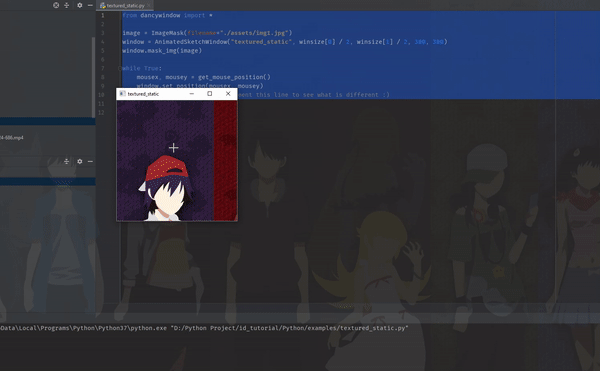
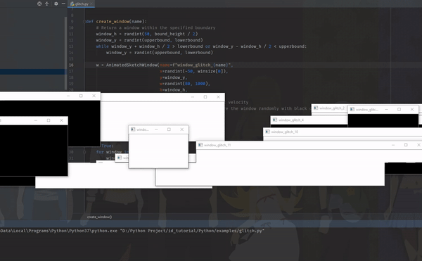
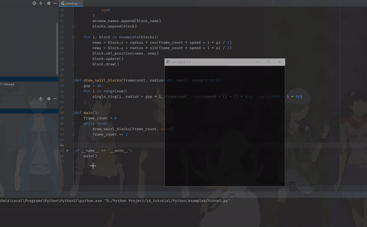
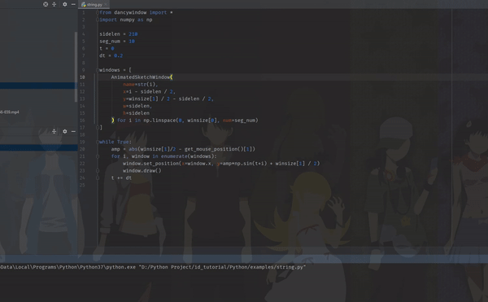
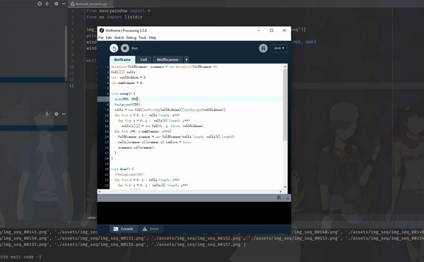
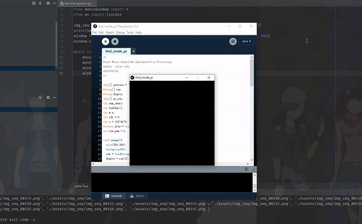
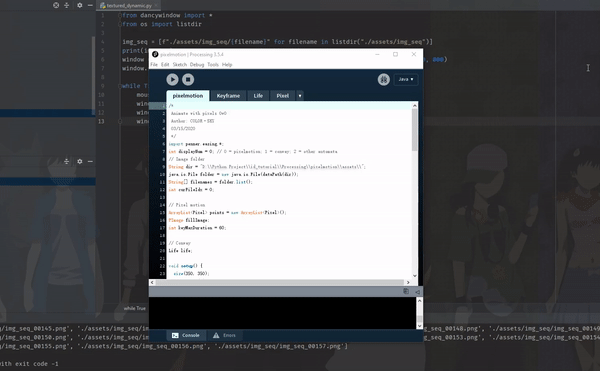

# ID:INVADED-WINDOWED
Source code of my project ID:INVADED(WINDOWED) https://www.bilibili.com/video/BV1GE411c7pm
## Prerequisites
- opencv-python
- Pillow
- numpy
- pyautogui
- pywinauto
- pywin32(download [this](https://www.lfd.uci.edu/~gohlke/pythonlibs/#pywin32) if you are using python3.7+)
## 

# Python
## textured_static.py

## textured_dynamic.py

## glitch.py

## tunnel.py

## grid.py

## random_windows.py

## string.py

## planet.py

## cxk.py([openpose](https://github.com/CMU-Perceptual-Computing-Lab/openpose) needed)

------
# Processing
## Wolfram

## find_inside_pi ([1 Trillion Digits of Pi](https://archive.org/download/pi_dec_1t) needed)

## pixelmotion

